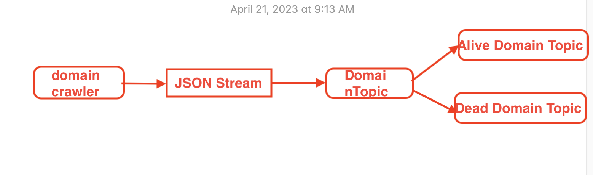
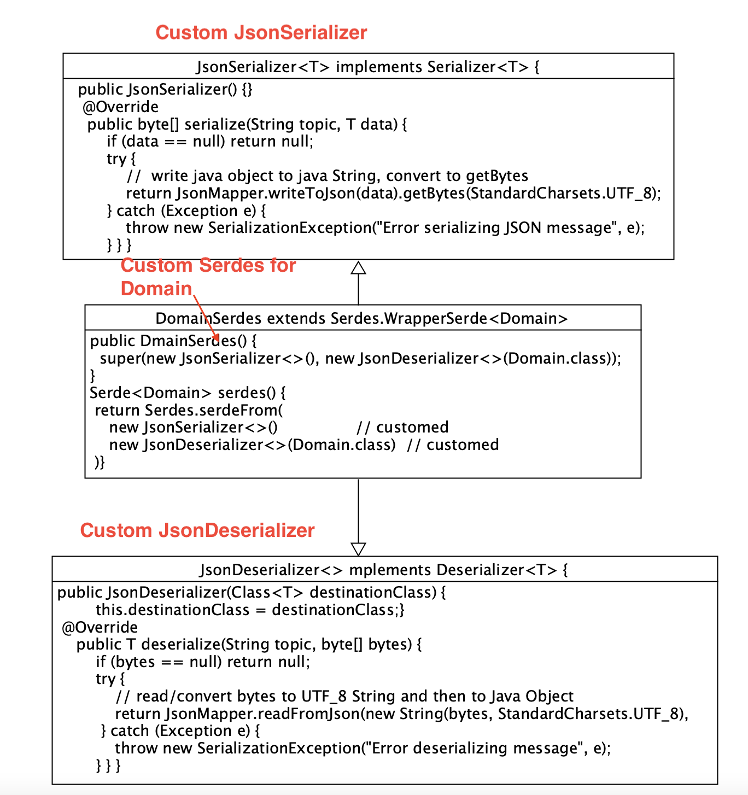
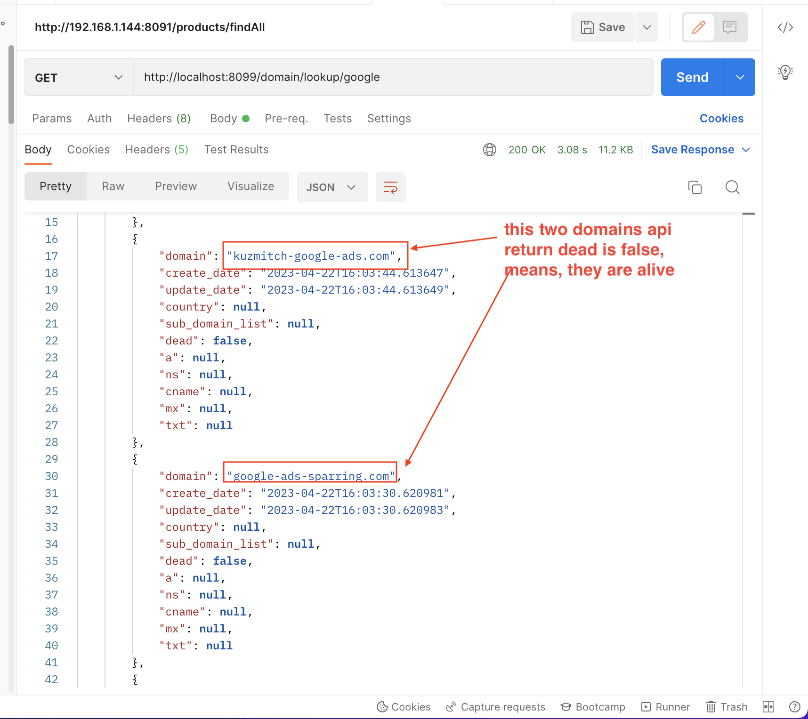
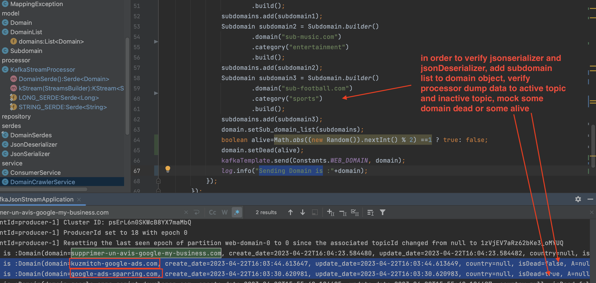
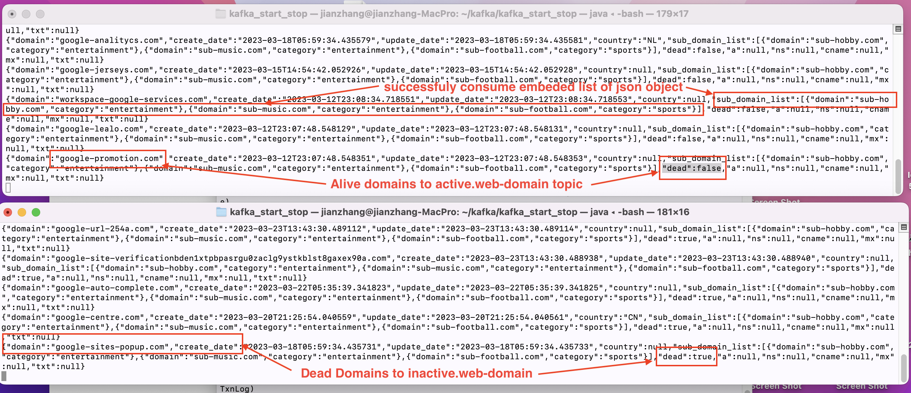
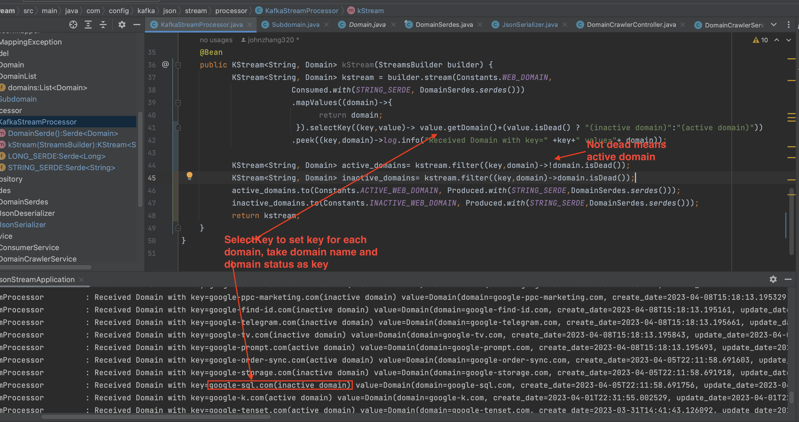
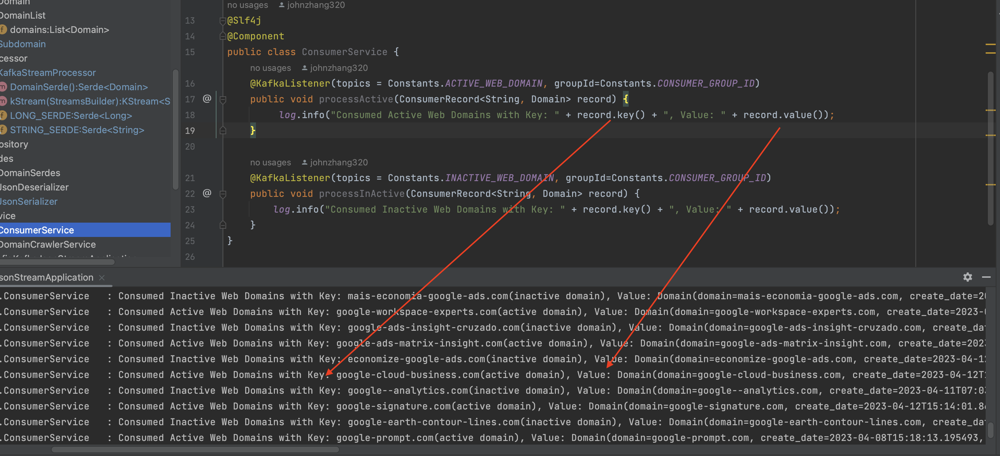

# spring-boot-kafka-json-stream
 
## Key points:
  
  1. how to configure the spring-boot kafka json stream
  2. how to create JSON Stream Serde with custom JsonDeserializer
  3. how to consume the stream from source topic and obtain POJO , then check member method in POJO
  4. how to produce new streams to different topics based on checking POJO
  5. make structured model data (one to many) and consumer listens original pojo in consumer side from other topics

## Work Flow

 

Domain crawler code gathers company domains into domain pojo objects from web and saving to domain topic and stream consumer listens domain POJO,
check isDead() methond in domain pojo, if domain is still alive, save in active domain topic , if dead, dump to inactive domain topic

   
## Start Zookeeper and Kafka
       download kafka_2.12-2.1.0.tgz from https://archive.apache.org/dist/kafka/2.1.0/kafka_2.12-2.1.0.tgz
       tar cvx kafka_2.12-2.1.0.tgz
       add $KAFKA_HOME point to your kafka installation directory 
       cd ./spring-boot-kafka-event-driven/kafka_start_stop
       chmod 755 *
       zookeeper_start.sh
       kafka_start.sh
       jps
       make sure following two processes running
       xxxx QuorumPeerMain
       xxxx Kafka
       
### All topics will be automatically created by java code   
   we can use shell script in directory kafka_start_stop to show topic, producer and consumer status content 

## Running Evirnomenet
     JDK17
     Spring boot 2.7.10
     spring-kafka
     kafka-streams
     spring-boot-starter-webflux
 

## Data Model
### Domain class
     @Data
     @AllArgsConstructor
     @NoArgsConstructor
     @Builder
     @ToString
     public class Domain {
         private String domain; //     "domain": "facebook-hosting.com",
         private String  create_date;        //   "create_date": "2023-02-13T06:05:59.477155",
         private String  update_date;        //      "update_date": "2023-02-13T06:05:59.477157",
         private String  country;         //     "country": null,
         private boolean   isDead;        //      "isDead": "False",
         private String   A;        //     "A": null,
         private String   NS;         //    "NS": null,
         private String   CNAME;         //     "CNAME": null,
         private String   MX;        //    "MX": null,
         private String   TXT;        //     "TXT": null
         private List<Subdomain> sub_domain_list;  // test structured json
     }
     
 ### SubDomain class 
       @Data
       @AllArgsConstructor
       @NoArgsConstructor
       @Builder
       public class Subdomain {
         private String domain;
         private boolean active;
         private String category;
     }
 ### crawler domains Rest API
 
      @RestController
      @RequestMapping("/domain")
      public class DomainCrawlerController {
          @Autowired
          private DomainCrawlerService domainCrawlerService;
          @GetMapping("/lookup/{name}")
          public Mono<DomainList> lookup(@PathVariable("name") String name) {
              Mono<DomainList> domains= domainCrawlerService.crawl(name);
              // show the crawler result
              return domains;
          }
      }     
### Domains Crawler Service
   We use Spring Webflux client to access https://api.domainsdb.info/v1/domains/search?domain=companyname (note this website may be temporaryly
   unavailable return 503 error code), in order to increase the POJO Domain object
   one to many structure we add simulated data to SubDomain list 
      
        @Service
        @Slf4j
        public class DomainCrawlerService {

            @Autowired
            private KafkaTemplate<String, Domain> kafkaTemplate;
            static List<Domain> list = new ArrayList<>();
            public Mono<DomainList> crawl(String name) {

                Mono<DomainList>  domainListMono =
                   WebClient.create()
                        .get()
                        .uri("https://api.domainsdb.info/v1/domains/search?domain="+name+"&zone=com")
                        .accept(MediaType.APPLICATION_JSON)
                        .retrieve()
                        .bodyToMono(DomainList.class);

                  int i=0;
                /**
                 *  mock dead field randomly to verify if processor can verify alive or inactive domain
                 */
                domainListMono.subscribe(domainList->{
                    domainList.getDomains().forEach(domain->{
                        List<Subdomain> subdomains = new ArrayList<>();
                        //test structure json object consumer
                        Subdomain subdomain1 = Subdomain.builder()
                                .domain("sub-hobby.com")
                                .category("entertainment")
                                .build();
                        subdomains.add(subdomain1);
                        Subdomain subdomain2 = Subdomain.builder()
                                .domain("sub-music.com")
                                .category("entertainment")
                                .build();
                        subdomains.add(subdomain2);
                        Subdomain subdomain3 = Subdomain.builder()
                                .domain("sub-football.com")
                                .category("sports")
                                .build();
                        subdomains.add(subdomain3);
                        domain.setSub_domain_list(subdomains);
                        boolean alive=Math.abs((new Random()).nextInt() % 2) ==1 ? true: false;
                        domain.setDead(alive);
                        kafkaTemplate.send(Constants.WEB_DOMAIN, domain);
                        log.info("Sending Domain is :"+domain);
                    });
                });

                return domainListMono;
            }
        }
   
   
### Configure JSON Stream Objects producer and consumer are similar to my another repository 

   spring-boot-kafka-event-driven.kafka-json-code-producer-consumer, therefore I do not repeatedly explaination or check this repository

### Here I need to explain Stream Configure
     1.Kafka Stream Configuration
       kstream process seems to accept KStream<String, Domain> kStream(StreamsBuilder builder), I try to use other 
       function name other than 'kStream' and not use 'defaultKafkaStreamsConfig' as name of KafkaStreamsConfiguration bean, spring boot failed
       Therefore, I keep the configuration Bean name as defaultKafkaStreamsConfig
       
     2.Setup Kafka Stream Sampling Timing Window by StreamsConfig.COMMIT_INTERVAL_MS_CONFIG, 10 * 1000), I tested, if take away this, stream process
       always running, reversely, consume data extremely slow even stopped because tranform code starved (no chance to run)
    
     3. eliminate data cache by props.put(StreamsConfig.CACHE_MAX_BYTES_BUFFERING_CONFIG, 0);
       
       @Configuration
       @EnableKafkaStreams
       @EnableKafka
       public class KafkaStreamsConfig {

       ....... Create Topic omitted here , only show KafkaStream Bean here---------

      @Bean (name= KafkaStreamsDefaultConfiguration.DEFAULT_STREAMS_CONFIG_BEAN_NAME)
      public KafkaStreamsConfiguration kafkaStreamsConfiguration() {
          Map<String, Object> props=new HashMap<>();
          props.put(StreamsConfig.BOOTSTRAP_SERVERS_CONFIG, Constants.BOOTSTRAP_SERVER);
          props.put(StreamsConfig.APPLICATION_ID_CONFIG, Constants.APPLICATION_CONFIG_ID);
          props.put(StreamsConfig.CLIENT_ID_CONFIG, Constants.CLIENT_ID_CONFIG);
          props.put(StreamsConfig.DEFAULT_KEY_SERDE_CLASS_CONFIG, Serdes.String().getClass().getName());
          props.put(StreamsConfig.DEFAULT_VALUE_SERDE_CLASS_CONFIG,Serdes.Long().getClass().getName());
          // stream sampling time window
          props.put(StreamsConfig.COMMIT_INTERVAL_MS_CONFIG, 10 * 1000);
          // For illustrative purposes we disable record caches.
          props.put(StreamsConfig.CACHE_MAX_BYTES_BUFFERING_CONFIG, 0);
          props.put(StreamsConfig.DEFAULT_TIMESTAMP_EXTRACTOR_CLASS_CONFIG, WallclockTimestampExtractor.class.getName());
          return new KafkaStreamsConfiguration(props);
      }

 ### Custom DomainSerdes using customed JsonSerializer and JsonDeserializer 
    Class Diagram as below:
    
 
  
 
  Above diagram shows how DmainSerdes class applied customed JsonSerializer and JsonDeserializer, those two classes applied JsonMapper reader 
  
  and writer, which writes java pojo to Json String/bytes and reads Json String/bytes to Java pojo no matter how complicated pojo is
 
 DomainSerdes Class will be used in kstream processor  
 
        public final class DomainSerdes extends Serdes.WrapperSerde<Domain> {

           public DomainSerdes() {
               // customize com.config.kafka.json.stream.serdes.JsonSerializer and Jcom.config.kafka.json.stream.serdes.JsonDeserializer
               super(new JsonSerializer<>(), new JsonDeserializer<>(Domain.class));
           }
           // usage DomainSerdes.serdes()
           public static Serde<Domain> serdes() {
               JsonSerializer<Domain> serializer = new JsonSerializer<>();
               JsonDeserializer<Domain> deserializer = new JsonDeserializer<>(Domain.class);
               return Serdes.serdeFrom(serializer, deserializer);
           }
       }
 Customed JsonSerializer ensure Json Object (generic T) to be writed to String and convert to bytes for stream producer
 Here JsonMapper.writeToJson is wrapping the com.fasterxml.jackson.databind.ObjectMapper.writeValueAsString
 
      public class JsonSerializer<T> implements Serializer<T> {

          public JsonSerializer() {
          }
          @Override
          public void configure(Map<String, ?> props, boolean isKey) {
          }
          // serialize Java Object to java Bytes String
          @Override
          public byte[] serialize(String topic, T data) {
              if (data == null)
                  return null;
              try {
                  //  JsonMapper.writeToJson(data) write java object to java String and then getBytes convert string to
                  //  java bytes (UTF_8) stream
                  return JsonMapper.writeToJson(data).getBytes(StandardCharsets.UTF_8);
              } catch (Exception e) {
                  throw new SerializationException("Error serializing JSON message", e);
              }
          }
          @Override
          public void close() {
          }
      }
 Customed JsonDeserializer ensure Json String byte stream to be convert to Object for consumer listen directly get object (here is Domain)
 here JsonMapper.readFromJson is wrapping the com.fasterxml.jackson.databind.ObjectMapper.readVlue
 
      public class JsonDeserializer<T> implements Deserializer<T> {

          private Class<T> destinationClass;

          public JsonDeserializer(Class<T> destinationClass) {
              this.destinationClass = destinationClass;
          }

          @Override
          public void configure(Map<String, ?> props, boolean isKey) {
          }
          // Deserialize byte[] to an objects
          @Override
          public T deserialize(String topic, byte[] bytes) {
              if (bytes == null)
                  return null;
              try {
                  // convert bytes to UTF_8 String and then JsonMapper.readFromJson convert string to Java Object
                  return JsonMapper.readFromJson(new String(bytes, StandardCharsets.UTF_8), destinationClass);
              } catch (Exception e) {
                  throw new SerializationException("Error deserializing message", e);
              }
          }

          @Override
          public void close() {
          }
      }
      
  Underneath code is customed JsonMapper which wrapped com.fasterxml.jackson.databind.ObjectMapper.readVlue and 
  
  com.fasterxml.jackson.databind.ObjectMapper.writeValueAsString , points is we configure objectMapper 
 
          public class JsonMapper {

           private static final ObjectMapper objectMapper = new ObjectMapper();

           static {
            objectMapper.configure(SerializationFeature.FAIL_ON_EMPTY_BEANS, false);
            objectMapper.configure(DeserializationFeature.FAIL_ON_UNKNOWN_PROPERTIES, false);
            objectMapper.configure(SerializationFeature.WRITE_DATES_AS_TIMESTAMPS, false);
            objectMapper.configure(SerializationFeature.WRITE_DURATIONS_AS_TIMESTAMPS, false);
            objectMapper.findAndRegisterModules();
           }

           /**
            * Map the given JSON String to the required class type.
            */
           public static <T> T readFromJson(String json, Class<T> clazz) throws MappingException {
            try {
             return objectMapper.readValue(json, clazz);
            } catch (Exception e) {
             throw new MappingException(e);
            }
           }

           /**
            * Map the given Object to a JSON String.
            */
           public static String writeToJson(Object obj) throws MappingException {
            try {
             return objectMapper.writeValueAsString(obj);
            } catch (Exception e) {
             throw new MappingException(e);
            }
           }

           public static String writeJsonToPretty (String json)    {
            try {
             return objectMapper.writerWithDefaultPrettyPrinter().writeValueAsString(json);
            } catch (Exception e) {
             throw new MappingException(e);
            }
           }
           public static String writeObjectToPrettyJson (Object obj)  {
            String json = writeToJson(obj);
            return writeJsonToPretty (json);

           }
          }
 ### KStream Processor
     We used mapValues to fetch domain as value, use selectKey take domain name (domain.getDomain()) + dead status as a key
     
     transform result will be show by peek and Log4j , then save active domain topic and inactive domain topic
     
       @Bean
       public KStream<String, Domain> kStream(StreamsBuilder builder) {
              KStream<String, Domain> kstream = builder.stream(Constants.WEB_DOMAIN,
                           Consumed.with(STRING_SERDE, DomainSerdes.serdes()))
                           .mapValues((domain)->{
                                 return domain;
                            }).selectKey((key,value)-> value.getDomain()+(value.isDead() ? "(inactive domain)":"(active domain)"))
                           .peek((key,domain)->log.info("Received Domain with key=" +key+" value="+ domain));

              KStream<String, Domain> active_domains= kstream.filter((key,domain)->!domain.isDead());
              KStream<String, Domain> inactive_domains= kstream.filter((key,domain)->domain.isDead());
              active_domains.to(Constants.ACTIVE_WEB_DOMAIN, Produced.with(STRING_SERDE,DomainSerdes.serdes()));
              inactive_domains.to(Constants.INACTIVE_WEB_DOMAIN, Produced.with(STRING_SERDE,DomainSerdes.serdes()));
              return kstream;
       }
#### Test Result demo and analysis  
 
   Postman issue get url to search google domain names, all domain is alive (dead=false)

   http://localhost:8099/domain/lookup/google     

   

   Before producer send the domain list to kstream processor consumer

   To verify customed Serdes for JsonSerializer and JsonDeserializer, add 3 subdomains as arraylist to each domain

   In order to verify if kstram processor differentiate ability, mock some domains are alive and some domains are dead

   
   
   Kstream processor consumed the domain list and directed the alive domain to active.web-domain topic and dumped the inactive domain to 
   inactive.web-domain topic
   
   
   
   kstream processor transform peek result (received domain with key and value) and produce the domains
   
   
   
   consumer listened the produce and use ConsumerRecord<String, Domain> record) to receive domains
   
   
   
## Conclusion
  
  Spring boot Kafka JSON stream key points are creating DomainSerdes using generic customied JsonSerializer and JsonDeserializer. we try
  
  many times to make the json object can be serialized or deserialized working correctly  
  
  Another point is correctly using the serdes in kstream builder consumer and stream.to producer, the new topic stream consumer directly listen 
  
  and take (ConsumerRecord<String, Domain> record) as listener function arguments
  
     
     
     
    
