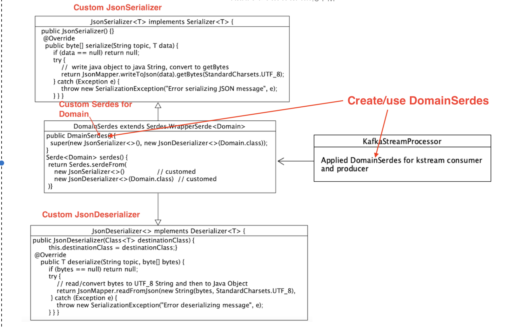

# spring-boot-kafka-json-stream
 
## Key points:
  
  1. how to configure the spring-boot kafka json stream
  2. how to create JSON Stream Serde with custom JsonDeserializer
  3. how to consume the stream from source topic and obtain POJO , then check member method in POJO
  4. how to produce new streams to different topics based on checking POJO
  5. make structured model data (one to many) and consumer listens original pojo in consumer side from other topics

## Work Flow

 

Domain crawler code gathers company domains into domain pojo objects from web and saving to domain topic and stream consumer listens domain POJO,
check isDead() methond in domain pojo, if domain is still alive, save in active domain topic , if dead, dump to inactive domain topic

   
## Start Zookeeper and Kafka
       download kafka_2.12-2.1.0.tgz from https://archive.apache.org/dist/kafka/2.1.0/kafka_2.12-2.1.0.tgz
       tar cvx kafka_2.12-2.1.0.tgz
       add $KAFKA_HOME point to your kafka installation directory 
       cd ./spring-boot-kafka-event-driven/kafka_start_stop
       chmod 755 *
       zookeeper_start.sh
       kafka_start.sh
       jps
       make sure following two processes running
       xxxx QuorumPeerMain
       xxxx Kafka
       
### All topics will be automatically created by java code   
   we can use shell script in directory kafka_start_stop to show topic, producer and consumer status content 

## Running Evirnomenet
     JDK17
     Spring boot 2.7.10
     spring-kafka
     kafka-streams
     spring-boot-starter-webflux
###  pom.xml as following     
          ....
         <parent>
         <groupId>org.springframework.boot</groupId>
         <artifactId>spring-boot-starter-parent</artifactId>
         <version>2.7.10</version>
         <relativePath/> <!-- lookup parent from repository -->
        </parent>
        <groupId>com.config.kafka.json.stream</groupId>
        <artifactId>spring-boot-kafka-json-stream</artifactId>
        <version>0.0.1-SNAPSHOT</version>
        <name>spring-boot-kafka-json-stream</name>
        <description>spring-boot-kafka-json-stream</description>
        <properties>
         <java.version>17</java.version>
        </properties>
        <dependencies>
         <dependency>
          <groupId>org.springframework.boot</groupId>
          <artifactId>spring-boot-starter-web</artifactId>
         </dependency>
         <dependency>
          <groupId>org.springframework.kafka</groupId>
          <artifactId>spring-kafka</artifactId>
          <version>2.8.11</version>
         </dependency>
         <dependency>
          <groupId>org.apache.kafka</groupId>
          <artifactId>kafka-streams</artifactId>
         </dependency>
         <dependency>
          <groupId>org.springframework.boot</groupId>
          <artifactId>spring-boot-starter-webflux</artifactId>
         </dependency>
         <!-- https://mvnrepository.com/artifact/org.apache.kafka/kafka-clients -->
         <dependency>
          <groupId>org.apache.kafka</groupId>
          <artifactId>kafka-clients</artifactId>
          <version>3.1.2</version>
         </dependency>
         <dependency>
          <groupId>org.springframework.cloud</groupId>
          <artifactId>spring-cloud-stream</artifactId>
          <version>3.2.3</version>
         </dependency>
         <dependency>
          <groupId>org.projectlombok</groupId>
          <artifactId>lombok</artifactId>
          <optional>true</optional>
         </dependency>
         <dependency>
          <groupId>org.springframework.boot</groupId>
          <artifactId>spring-boot-starter-test</artifactId>
          <scope>test</scope>
         </dependency>
        </dependencies>
       .....

## Data Model
### Domain class
     @Data
     @AllArgsConstructor
     @NoArgsConstructor
     @Builder
     @ToString
     public class Domain {
         private String domain; //     "domain": "facebook-hosting.com",
         private String  create_date;        //   "create_date": "2023-02-13T06:05:59.477155",
         private String  update_date;        //      "update_date": "2023-02-13T06:05:59.477157",
         private String  country;         //     "country": null,
         private boolean   isDead;        //      "isDead": "False",
         private String   A;        //     "A": null,
         private String   NS;         //    "NS": null,
         private String   CNAME;         //     "CNAME": null,
         private String   MX;        //    "MX": null,
         private String   TXT;        //     "TXT": null
         private List<Subdomain> sub_domain_list;  // test structured json
     }
     
 ### SubDomain class 
       @Data
       @AllArgsConstructor
       @NoArgsConstructor
       @Builder
       public class Subdomain {
         private String domain;
         private boolean active;
         private String category;
     }
### Domains Crawler Service
   We use Spring Webflux client to access https://api.domainsdb.info/v1/domains/search?domain=companyname(note this website may be temporaryly
   unavailable return 503 error code), in order to increase the POJO Domain object
   one to many structure we add simulated data to SubDomain list 
         @Service
         @Slf4j
         public class DomainCrawlerService {
             @Autowired
             private KafkaTemplate<String, Domain> kafkaTemplate;

             public List<Domain> crawl(String name) {
                 Mono<DomainList> domainListMono = WebClient.create()
                         .get()
                         .uri("https://api.domainsdb.info/v1/domains/search?domain="+name+"&zone=com")
                         .accept(MediaType.APPLICATION_JSON)
                         .retrieve()
                         .bodyToMono(DomainList.class);
                 int i=0;
                 List<Domain> list = new ArrayList<>();
                 domainListMono.subscribe(domainList->{
                     domainList.getDomains().forEach(domain->{
                         List<Subdomain> subdomains = new ArrayList<>();
                         //test structure json object consumer
                         Subdomain subdomain1 = Subdomain.builder()
                                 .domain("sub-hobby.com")
                                 .active(false)
                                 .category("entertainment")
                                 .build();
                         subdomains.add(subdomain1);
                         Subdomain subdomain2 = Subdomain.builder()
                                 .domain("sub-music.com")
                                 .active(true)
                                 .category("entertainment")
                                 .build();
                         subdomains.add(subdomain2);
                         Subdomain subdomain3 = Subdomain.builder()
                                 .domain("sub-football.com")
                                 .active(true)
                                 .category("sports")
                                 .build();
                         subdomains.add(subdomain3);
                         domain.setSub_domain_list(subdomains);
                         list.add(domain);
                         kafkaTemplate.send(Constants.WEB_DOMAIN, domain);
                         log.info("Sending Domain is :"+domain.getDomain());
                     });
                  });
                  return list;
              }
   
   
### Configure JSON Stream Objects producer and consumer are similar to my another repository 

   spring-boot-kafka-event-driven.kafka-json-code-producer-consumer, therefore I do not repeatedly explaination or check this repository

### Here I need to explain Stream Configure
     1.Kafka Stream Configuration
       kstream process seems to accept KStream<String, Domain> kStream(StreamsBuilder builder), I try to use other 
       function name other than 'kStream' and not use 'defaultKafkaStreamsConfig' as name of KafkaStreamsConfiguration bean, spring boot failed
       Therefore, I keep the configuration Bean name as defaultKafkaStreamsConfig
       
     2.Setup Kafka Stream Sampling Timing Window by StreamsConfig.COMMIT_INTERVAL_MS_CONFIG, 10 * 1000), I tested, if take away this, stream process
       always running, reversely, consume data extremely slow even stopped because tranform code starved (no chance to run)
    
     3. eliminate data cache by props.put(StreamsConfig.CACHE_MAX_BYTES_BUFFERING_CONFIG, 0);
     
     
     
       @Configuration
       @EnableKafkaStreams
       @EnableKafka
       public class KafkaStreamsConfig {

       ....... Create Topic omitted here , only show KafkaStream Bean here---------

      @Bean (name= KafkaStreamsDefaultConfiguration.DEFAULT_STREAMS_CONFIG_BEAN_NAME)
      public KafkaStreamsConfiguration kafkaStreamsConfiguration() {
          Map<String, Object> props=new HashMap<>();
          props.put(StreamsConfig.BOOTSTRAP_SERVERS_CONFIG, Constants.BOOTSTRAP_SERVER);
          props.put(StreamsConfig.APPLICATION_ID_CONFIG, Constants.APPLICATION_CONFIG_ID);
          props.put(StreamsConfig.CLIENT_ID_CONFIG, Constants.CLIENT_ID_CONFIG);
          props.put(StreamsConfig.DEFAULT_KEY_SERDE_CLASS_CONFIG, Serdes.String().getClass().getName());
          props.put(StreamsConfig.DEFAULT_VALUE_SERDE_CLASS_CONFIG,Serdes.Long().getClass().getName());
          // stream sampling time window
          props.put(StreamsConfig.COMMIT_INTERVAL_MS_CONFIG, 10 * 1000);
          // For illustrative purposes we disable record caches.
          props.put(StreamsConfig.CACHE_MAX_BYTES_BUFFERING_CONFIG, 0);
          props.put(StreamsConfig.DEFAULT_TIMESTAMP_EXTRACTOR_CLASS_CONFIG, WallclockTimestampExtractor.class.getName());
          return new KafkaStreamsConfiguration(props);
      }

 ### Custom DomainSerdes using customed JsonSerializer and JsonDeserializer 
    Class Diagram as below:
    
 
 
 
  Above diagram shows how DmainSerdes class applied customed JsonSerializer and JsonDeserializer, those two classes applied JsonMapper reader 
  and writer, which writes java pojo to Json String/bytes and reads Json String/bytes to Java pojo no matter how complicated pojo is
  
 ### KStream Processor
      @Bean
      public KStream<String, Domain> kStream(StreamsBuilder builder) {
          KStream<String, Domain> kstream = builder.stream(Constants.WEB_DOMAIN, Consumed.with(STRING_SERDE, DomainSerdes.serdes()))
                  .mapValues((domain)->{
                      domain.setDead(randData());
                      return domain;
                  }).peek((key,domain)->log.info("Received Domain with key="+key+", domain="+domain));
          KStream<String, Domain> active_domains= kstream.filter((key,domain)->domain.isDead());
          KStream<String, Domain> inactive_domains= kstream.filter((key,domain)->domain.isDead());
          active_domains.to(Constants.ACTIVE_WEB_DOMAIN, Produced.with(STRING_SERDE,DomainSerdes.serdes()));
          inactive_domains.to(Constants.INACTIVE_WEB_DOMAIN, Produced.with(STRING_SERDE,DomainSerdes.serdes()));
          return null;
      }
   
 #### Test Result demo and analysis  
